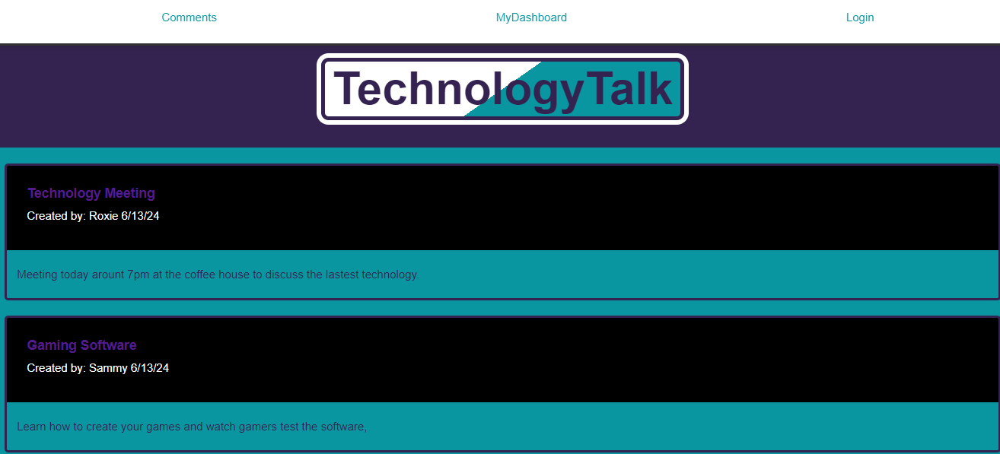

# BlogTech3

I want to create a website that allows users to blog about technology. Users will have to login first before they are able to post a comment. If the user is new then they will be given the option to signup. After verification of the user, the user will be able to read and create a comment to other users. The user will be able to start a post as well. User will be able to delete and edit their post if needed. User will be able to see who posted each comment and the date of each comment. Using mysql will allow to keep track of users and each comment. 

npm install
npm start

git@github.com:RoxD90/BlogTech3.git

https://github.com/RoxD90/BlogTech3.git

https://github.com/RoxD90/BlogTech3

https://roxd90.github.io/BlogTech3/

